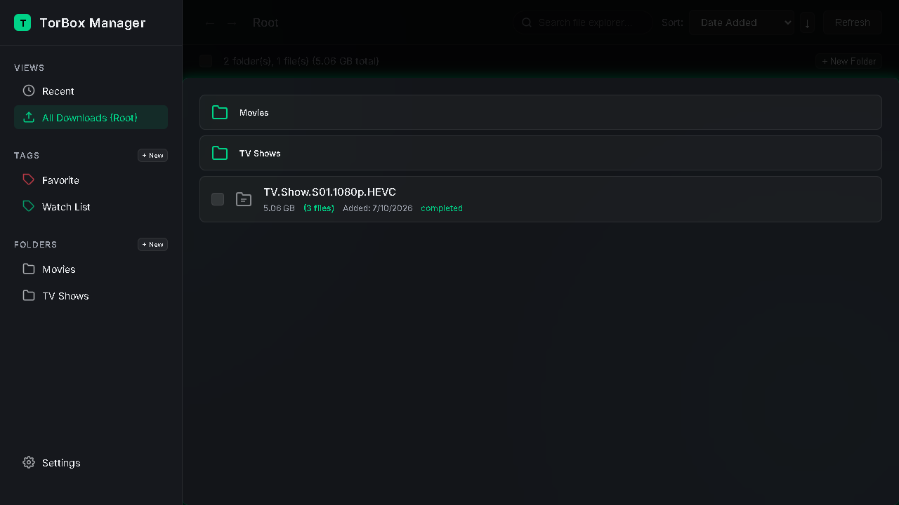
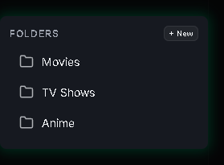
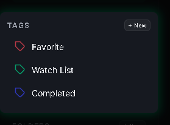
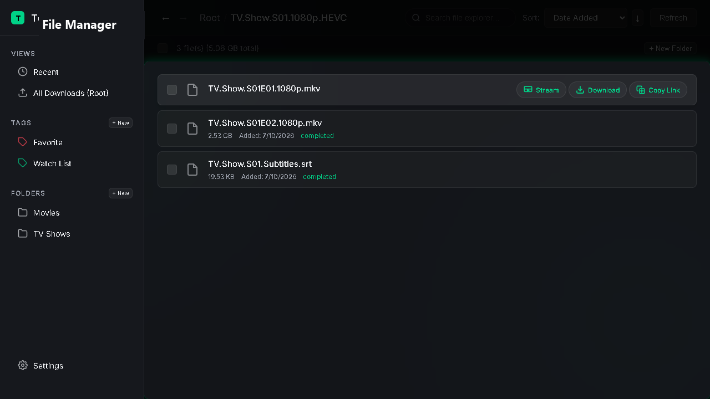
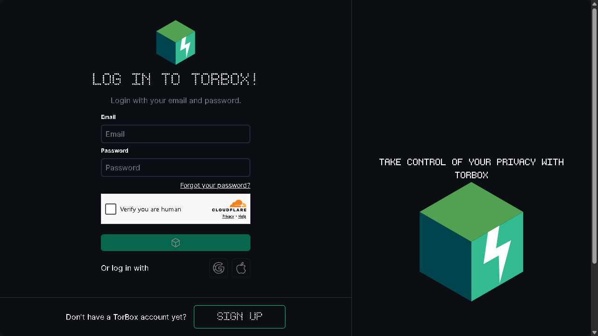

# 📁 File Manager for TorBox (Unofficial)

An elegant, open-source browser extension that adds a robust Virtual File System (VFS) layer with folders, subfolders, custom tags, and context-aware action sets directly on top of the **TorBox API**.

---

## ❓ What is TorBox?
[TorBox](https://torbox.app) is a high-speed cloud download and debrid service. It downloads torrents, magnet links, and Usenet NZBs onto its secure, high-speed servers. This allows users to download or stream files at maximum speeds without relying on slow peer connections or exposing their local IP address to public torrent swarms.

## 💡 Why is this Extension Useful?
While TorBox is exceptional at downloading and caching files, its official dashboard lists all your downloads in a **single, flat list**. There is no native way to:
* Organize downloads into folders and subfolders (directories).
* Assign custom category tags to organize files.
* Query, filter, and sort content easily.

This extension solves this problem by introducing a **fully local, zero-cost Virtual File System (VFS)**. It maps your flat TorBox download list into a structured file-explorer experience, complete with drag-and-drop folder organization, search, sorting, tag management, and contextual file actions.

---

## ✨ Features

### 📁 Folders & Subfolders
Create directories, nested subfolders, and move entire folders with automatic circular nesting safety checks. Double-click directories to open, and double-click files to trigger direct CDN downloads.

### 🏷️ Custom Tags & Categories
Create custom categories and tags with randomly generated color badges. Filter your entire catalog by tag categories with a single click.

### 🎬 Context-Aware Quick Actions (Legible & Labeled)
Hover over any file row to access responsive contextual quick-actions:
* **Stream Video (Play icon)**: Opens a video stream link directly in a new tab using the browser's native player (only shown for video files).
* **Direct Download (Downward tray icon)**: Automatically requests a temporary CDN link and redirects to begin the download.
* **Download as ZIP (Folder ZIP icon)**: Zips multi-file torrents and downloads the folder bundle (only shown for multi-file torrent folders).
* **Copy Link (Chain link icon)**: Copies a permanent, redirecting CDN link to your clipboard.

To prevent clutter, file metadata is automatically faded out on hover, providing clean space for the larger, labeled buttons with zero visual clipping!

### 🔄 Multi-File Torrent Directories
Torrents containing multiple files are treated as directories. Double-clicking them navigates into an expanded list, allowing you to stream, copy links, or download individual files inside the torrent package.

### 📥 One-Click Dashboard Switcher
If you visit `https://torbox.app/dashboard`, the extension automatically injects a sleek, floating glassmorphism **"Open TorBox Manager"** button. One click switches your view into your organized local extension dashboard!

---

## 🔒 API Key & Data Security
* **Zero External Servers**: The extension runs entirely in your browser. Your API key and folders are never sent to any third-party servers. All requests are made directly and securely from your browser to the official `https://api.torbox.app` API endpoints.
* **Safe Local Storage**: Your API key is stored locally in the browser's secure memory (`chrome.storage.sync` with a `chrome.storage.local` fallback).
* **Git Safe**: The repository configuration ensures that no user keys or personal configuration datasets are ever hardcoded or published to version control.

---

## 🌐 Free Cross-Device Syncing & Backups
* **Browser Profile Syncing**: The extension saves your folders and file-to-folder mappings using `chrome.storage.sync`. This means your organized directories automatically sync for free across all computers and browsers signed into your browser profile (e.g. Google Chrome sync).
* **Local Backups**: Under settings, you can manually click **📥 Export Backup** to download your configuration as a JSON file, or **📤 Import Backup** to restore your setup when migrating between browser engines (such as moving from Chrome to Opera GX).

---

## 🛠️ Installation

### 📥 Simple Installation (For Non-Technical Users)
1. Download the precompiled extension zip bundle: **`torbox-file-manager-alpha.zip`** from our [Latest Releases](https://github.com/officebeats/torbox-file-manager/releases).
2. Extract the ZIP file to a permanent folder on your computer.
3. Open your browser's extensions management page:
   * **Chrome**: Visit `chrome://extensions`
   * **Opera/Opera GX**: Visit `opera://extensions`
4. Enable **Developer mode** (the toggle switch in the top-right corner of the page).
5. Click the **Load unpacked** button in the top-left, and select the extracted folder containing the extension files.
6. Click the extension icon in your browser to launch the TorBox Manager!

---

## 💻 Technical Setup & Collaboration
For details on building from source, file architecture, and guidelines on how to contribute features or report bugs, please refer to our **[Contributing Guide](CONTRIBUTING.md)**.

---

## 👨‍💻 About the Project / Creator
Hi! I'm a **Product Manager** who loves learning, exploring, and building with AI coding assistants on weekends. This extension was co-created using agentic AI models to build a premium, highly responsive user interface for debrid power users.

* **Tech Founders**: If you are looking for a product counterpart, product coach, or co-founder to collaborate on a new project or take a product from 0 to 1, I'd love to chat!
* **Product Managers**: If you are exploring AI workflows, seeking mentorship, or just want to swap ideas, feel free to connect!

Let's connect:
* 🌐 **LinkedIn**: [linkedin.com/in/productmg](https://www.linkedin.com/in/productmg/)
* 🐦 **X / Twitter**: [@officebeats](https://x.com/officebeats)
